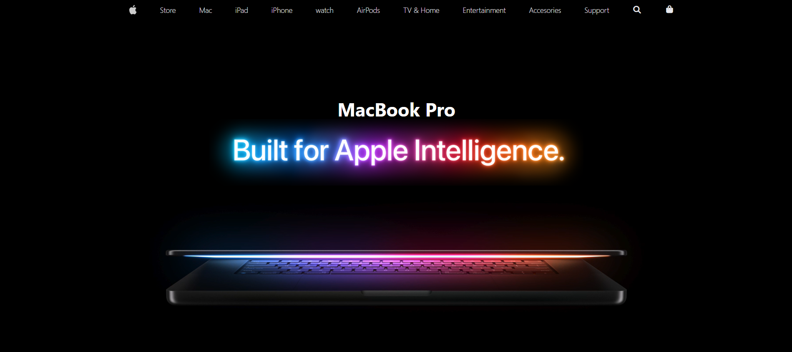
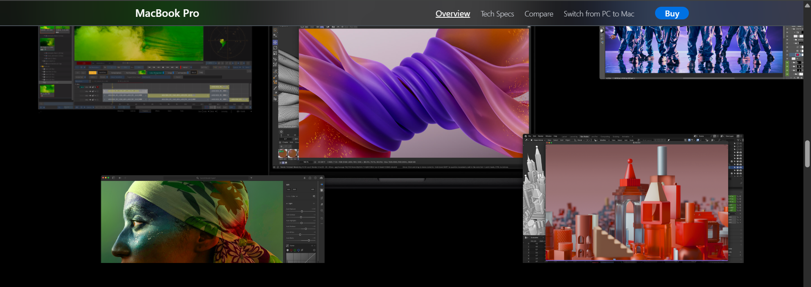
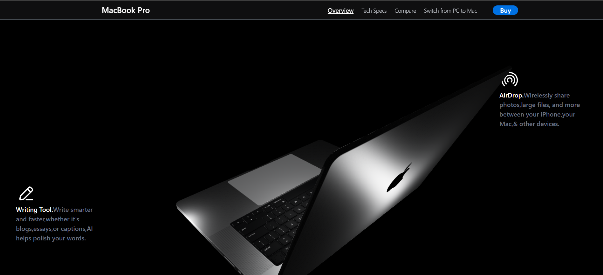

# MacBook Pro Website Clone

A **MacBook Pro website clone** inspired by Apple’s official site, built with **React**, **Three.js**, **GSAP**, and **Tailwind CSS**. This project features a fully responsive layout, scroll-triggered animations, text reveals, and a 3D interactive MacBook model.  

🔗 **Live Demo:** [https://apple-mac-sable.vercel.app/](https://apple-mac-sable.vercel.app/)  

---

## Features

- ✅ Cloned Apple’s UI, including the **glass-like translucent navbar**  
- ✅ Smooth **scroll-based animations** with GSAP and ScrollTrigger  
- ✅ Interactive **3D MacBook model** rendered with Three.js and `@react-three/fiber`  
- ✅ Fully **responsive design** across desktop and mobile devices  
- ✅ Original code for layout, UI, animations, and interactions (only minor help for 3D rotation logic)

---

## Tech Stack

- **React + Vite** – Frontend framework and fast development environment  
- **GSAP + ScrollTrigger** – Scroll-based animations  
- **Three.js + @react-three/fiber** – 3D model rendering  
- **Tailwind CSS** – Styling and responsive design  

---

## Screenshots

  
*Hero section with video background and 3D MacBook preview*  

  
*Glass-like translucent navbar cloned from Apple’s site*  

  
*Interactive 3D MacBook with scroll animations*

---

## Installation

1. Clone the repository:
```bash
git clone https://github.com/Kartikey-Pathak/Apple-Mac
